# Domain Entities - IteraSpaces Challenge Platform

## Overview
This document defines the core domain entities for the IteraSpaces platform based on the user stories. The entities are organized around key business domains: User Management, Challenge Management, Submission & Collaboration, Evaluation, Content Management, and System Infrastructure.

## Entity Relationship Diagram

```mermaid
erDiagram
    User ||--o{ UserProfile : has
    User ||--o{ Badge : earns
    User ||--o{ UserFollowing : "follows/followed-by"
    User ||--o{ Notification : receives
    User ||--o{ Submission : creates
    User ||--o{ Comment : writes
    User ||--o{ Vote : casts
    User ||--o{ Reaction : makes
    User ||--o{ Review : conducts
    User ||--o{ BlogPost : authors
    User ||--o{ Announcement : creates
    User ||--o{ ModerationAction : "performs/receives"
    User ||--o{ ActivityFeedItem : generates
    
    Challenge ||--o{ ChallengePhase : "has many"
    Challenge ||--o{ EvaluationCriteria : defines
    Challenge ||--o{ Submission : "receives"
    Challenge ||--o{ FAQ : contains
    Challenge ||--o{ ChallengeResource : includes
    Challenge ||--o{ Announcement : has
    Challenge }o--|| User : "sponsored-by"
    Challenge ||--o{ ChallengeParticipant : "has"
    Challenge ||--o{ Tag : uses
    
    Submission ||--o{ SubmissionVersion : "has history"
    Submission ||--o{ Comment : "receives"
    Submission ||--o{ Vote : "receives"
    Submission ||--o{ Reaction : "receives"
    Submission ||--o{ MediaFile : contains
    Submission ||--o{ Review : "evaluated-by"
    Submission ||--o{ SubmissionTag : "tagged-with"
    Submission ||--o{ SubmissionRelationship : "inspired-by/builds-on"
    Submission }o--|| User : "created-by"
    Submission }o--|| Challenge : "submitted-to"
    
    Review ||--o{ CriteriaScore : "has scores"
    Review }o--|| User : "conducted-by"
    Review }o--|| Submission : evaluates
    
    CriteriaScore }o--|| EvaluationCriteria : "scores against"
    
    Comment ||--o{ Comment : "has replies"
    Comment }o--|| User : "written-by"
    Comment }o--|| Submission : "on"
    Comment }o--o| Comment : "reply-to"
    
    BlogPost ||--o{ BlogComment : receives
    BlogPost ||--o{ BlogCategory : "categorized-by"
    BlogPost }o--|| User : "authored-by"
    
    MediaFile }o--|| Submission : "attached-to"
    MediaFile }o--|| User : "uploaded-by"
    
    Tag ||--o{ SubmissionTag : "used-in"
    
    Notification }o--|| User : "sent-to"
    
    ModerationAction }o--|| User : "moderator"
    ModerationAction }o--|| User : "target"
    
    UserProfile }o--|| User : belongs-to
    
    ActivityFeedItem }o--|| User : "generated-by"
    
    ChallengeParticipant }o--|| User : is
    ChallengeParticipant }o--|| Challenge : "participates-in"
```

## Core Domain Entities

### User Management Domain

#### User
Primary entity for authentication and identity.

**Attributes:**
- UserId (PK)
- Email
- PasswordHash
- FirebaseUid (for Firebase Auth integration)
- AuthProvider (Email, Google, GitHub)
- EmailVerified
- AccountStatus (Active, Suspended, Banned)
- CreatedAt
- LastLoginAt
- IsAdmin
- IsCommunityManager

**Relationships:**
- Has one UserProfile
- Has many Submissions
- Has many Comments
- Has many Reviews
- Has many Notifications
- Has many Badges
- Follows many Users (UserFollowing)
- Creates many BlogPosts
- Creates many Announcements

---

#### UserProfile
Extended user information and preferences.

**Attributes:**
- ProfileId (PK)
- UserId (FK)
- DisplayName
- Bio
- ProfilePhotoUrl
- Location
- Skills (JSON array)
- Interests (JSON array)
- PortfolioUrl
- SocialMediaLinks (JSON)
- PrivacySettings (JSON)
- NotificationPreferences (JSON)
- CreatedAt
- UpdatedAt

---

#### Badge
Recognition and achievements system.

**Attributes:**
- BadgeId (PK)
- Name
- Description
- IconUrl
- Criteria (JSON)
- BadgeType (Achievement, Milestone, Recognition)
- IsActive
- CreatedAt

**Relationships:**
- Earned by many Users (UserBadge join table)

---

#### UserFollowing
Tracks user social connections.

**Attributes:**
- FollowingId (PK)
- FollowerId (FK to User)
- FollowedUserId (FK to User)
- CreatedAt

---

#### Notification
User notifications and alerts.

**Attributes:**
- NotificationId (PK)
- UserId (FK)
- Type (Comment, PhaseTransition, Follow, Badge, Announcement)
- Title
- Message
- RelatedEntityType (Submission, Challenge, Comment, etc.)
- RelatedEntityId
- IsRead
- IsSent (for email notifications)
- CreatedAt
- ReadAt

---

#### ActivityFeedItem
Activity stream for user feeds.

**Attributes:**
- ActivityId (PK)
- UserId (FK)
- ActivityType (Submission, Comment, Vote, Follow, Badge)
- EntityType
- EntityId
- Content (JSON)
- Visibility (Public, Followers, Private)
- CreatedAt

---

### Challenge Management Domain

#### Challenge
Core entity representing an innovation challenge.

**Attributes:**
- ChallengeId (PK)
- SponsorId (FK to User)
- Title
- Description
- Objectives (text)
- BackgroundInfo (text)
- State (Draft, Active, Evaluation, Closed, Archived)
- Visibility (Public, Private)
- ParticipationRestrictions (JSON)
- CreatedAt
- UpdatedAt
- PublishedAt
- ClosedAt

**Relationships:**
- Has many ChallengePhases
- Has many EvaluationCriteria
- Has many Submissions
- Has many FAQs
- Has many ChallengeResources
- Has many Announcements
- Has many ChallengeParticipants
- Sponsored by one User

---

#### ChallengePhase
Defines the timeline stages of a challenge.

**Attributes:**
- PhaseId (PK)
- ChallengeId (FK)
- Name (Ideation, Refinement, Evaluation, Selection)
- Description
- StartDate
- EndDate
- IsActive
- OrderIndex
- AllowSubmissions
- AllowEdits
- CreatedAt
- UpdatedAt

---

#### EvaluationCriteria
Criteria for evaluating submissions.

**Attributes:**
- CriteriaId (PK)
- ChallengeId (FK)
- Name
- Description
- Weight (percentage)
- MinScore
- MaxScore
- ScoringGuidelines (text)
- OrderIndex
- CreatedAt

**Relationships:**
- Used in many CriteriaScores

---

#### FAQ
Frequently asked questions for a challenge.

**Attributes:**
- FAQId (PK)
- ChallengeId (FK)
- Question
- Answer
- Category
- OrderIndex
- ViewCount
- CreatedAt
- UpdatedAt

---

#### ChallengeResource
Supporting materials for challenges.

**Attributes:**
- ResourceId (PK)
- ChallengeId (FK)
- Title
- Description
- ResourceType (Document, Video, Link, Image)
- FileUrl
- FileSize
- MimeType
- OrderIndex
- CreatedAt

---

#### ChallengeParticipant
Tracks user participation in challenges.

**Attributes:**
- ParticipantId (PK)
- ChallengeId (FK)
- UserId (FK)
- JoinedAt
- IsFollowing (receiving notifications)
- LastActivityAt

---

### Submission & Collaboration Domain

#### Submission
User-submitted ideas for challenges.

**Attributes:**
- SubmissionId (PK)
- ChallengeId (FK)
- UserId (FK)
- Title
- Content (markdown)
- Status (Draft, Published, UnderReview, Selected, Rejected)
- IsPublic
- ViewCount
- CurrentVersionNumber
- CreatedAt
- UpdatedAt
- PublishedAt

**Relationships:**
- Has many SubmissionVersions
- Has many Comments
- Has many Votes
- Has many Reactions
- Has many Reviews
- Has many MediaFiles
- Has many SubmissionTags
- Has many SubmissionRelationships

---

#### SubmissionVersion
Version history for submissions.

**Attributes:**
- VersionId (PK)
- SubmissionId (FK)
- VersionNumber
- Content (markdown)
- ChangeNote
- CreatedAt
- CreatedBy (FK to User)

---

#### SubmissionRelationship
Tracks relationships between submissions (inspired by, builds on).

**Attributes:**
- RelationshipId (PK)
- SourceSubmissionId (FK)
- TargetSubmissionId (FK)
- RelationshipType (InspiredBy, BuildsOn, Related)
- Note
- CreatedAt

---

#### Comment
Comments on submissions or blog posts.

**Attributes:**
- CommentId (PK)
- UserId (FK)
- EntityType (Submission, BlogPost)
- EntityId
- ParentCommentId (FK, nullable for threaded comments)
- Content (markdown)
- IsEdited
- IsDeleted
- CreatedAt
- UpdatedAt

**Relationships:**
- Has many child Comments (replies)
- Belongs to one parent Comment (optional)

---

#### Vote
Upvotes/downvotes on submissions.

**Attributes:**
- VoteId (PK)
- UserId (FK)
- SubmissionId (FK)
- VoteType (Upvote, Downvote)
- CreatedAt
- UpdatedAt

---

#### Reaction
Emoji reactions on submissions.

**Attributes:**
- ReactionId (PK)
- UserId (FK)
- SubmissionId (FK)
- ReactionType (Heart, Fire, Clap, ThumbsUp, etc.)
- CreatedAt

---

#### MediaFile
Files attached to submissions.

**Attributes:**
- MediaFileId (PK)
- SubmissionId (FK)
- UploadedBy (FK to User)
- FileName
- FileUrl
- CdnUrl
- FileSize
- MimeType
- MediaType (Image, Video, Document)
- ThumbnailUrl
- CreatedAt

---

#### Tag
Tags for categorizing submissions.

**Attributes:**
- TagId (PK)
- Name
- Description
- UsageCount
- CreatedAt

**Relationships:**
- Used in many SubmissionTags

---

#### SubmissionTag
Join table for submissions and tags.

**Attributes:**
- SubmissionTagId (PK)
- SubmissionId (FK)
- TagId (FK)
- CreatedAt

---

### Evaluation Domain

#### Review
Evaluation of a submission by a reviewer.

**Attributes:**
- ReviewId (PK)
- SubmissionId (FK)
- ReviewerId (FK to User)
- ChallengeId (FK)
- OverallScore (calculated)
- OverallComments
- IsComplete
- IsPublic
- CreatedAt
- UpdatedAt
- CompletedAt

**Relationships:**
- Has many CriteriaScores

---

#### CriteriaScore
Individual criterion score within a review.

**Attributes:**
- CriteriaScoreId (PK)
- ReviewId (FK)
- CriteriaId (FK)
- Score
- Feedback (text)
- CreatedAt

---

### Content Management Domain

#### BlogPost
Blog posts for platform content.

**Attributes:**
- PostId (PK)
- AuthorId (FK to User)
- Title
- Content (markdown)
- FeaturedImageUrl
- Status (Draft, Scheduled, Published)
- ScheduledPublishDate
- PublishedAt
- ViewCount
- ReadingTimeMinutes
- CreatedAt
- UpdatedAt

**Relationships:**
- Has many BlogComments
- Belongs to many BlogCategories

---

#### BlogCategory
Categories for organizing blog posts.

**Attributes:**
- CategoryId (PK)
- Name
- Slug
- Description
- CreatedAt

---

#### BlogComment
Comments on blog posts.

**Attributes:**
- CommentId (PK)
- PostId (FK)
- UserId (FK)
- ParentCommentId (FK, nullable)
- Content
- IsApproved
- CreatedAt
- UpdatedAt

---

#### Announcement
Announcements for challenges or platform-wide.

**Attributes:**
- AnnouncementId (PK)
- CreatedBy (FK to User)
- ChallengeId (FK, nullable for platform announcements)
- Title
- Content
- IsImportant (pinned)
- TargetAudience (All, Participants, Reviewers)
- CreatedAt
- UpdatedAt

---

### Moderation & Administration Domain

#### ModerationAction
Tracks moderation activities.

**Attributes:**
- ActionId (PK)
- ModeratorId (FK to User)
- TargetUserId (FK to User, nullable)
- TargetEntityType (Submission, Comment, User)
- TargetEntityId
- ActionType (Hide, Remove, Warn, Suspend, Ban, Restore)
- Reason
- Notes (internal)
- CreatedAt

---

#### ContentFlag
User-reported inappropriate content.

**Attributes:**
- FlagId (PK)
- ReportedBy (FK to User)
- EntityType (Submission, Comment)
- EntityId
- FlagReason (Spam, Inappropriate, Offensive, Other)
- Description
- Status (Pending, Reviewed, Resolved)
- ReviewedBy (FK to User)
- ReviewNotes
- CreatedAt
- ReviewedAt

---

### System & Infrastructure Domain

#### SystemConfiguration
Platform-wide settings.

**Attributes:**
- ConfigId (PK)
- ConfigKey
- ConfigValue (JSON)
- Description
- UpdatedAt
- UpdatedBy (FK to User)

---

#### AuditLog
System audit trail.

**Attributes:**
- LogId (PK)
- UserId (FK, nullable)
- EntityType
- EntityId
- Action (Create, Update, Delete, Login, etc.)
- OldValue (JSON)
- NewValue (JSON)
- IpAddress
- UserAgent
- CreatedAt

---

#### SearchIndex
Full-text search index metadata.

**Attributes:**
- IndexId (PK)
- EntityType
- EntityId
- SearchableContent (text)
- Metadata (JSON)
- LastIndexedAt

---

#### EmailTemplate
Email notification templates.

**Attributes:**
- TemplateId (PK)
- TemplateName
- Subject
- HtmlBody
- TextBody
- Variables (JSON)
- IsActive
- CreatedAt
- UpdatedAt

---

## Domain Aggregates

### Challenge Aggregate Root
- **Root:** Challenge
- **Entities:** ChallengePhase, EvaluationCriteria, FAQ, ChallengeResource, Announcement
- **Value Objects:** Phase dates, criteria weights

### Submission Aggregate Root
- **Root:** Submission
- **Entities:** SubmissionVersion, Comment, Vote, Reaction, MediaFile
- **Value Objects:** Vote counts, reaction counts

### User Aggregate Root
- **Root:** User
- **Entities:** UserProfile, Badge (through UserBadge)
- **Value Objects:** Skills, interests, social links

### Review Aggregate Root
- **Root:** Review
- **Entities:** CriteriaScore
- **Value Objects:** Overall score calculations

## Key Domain Patterns

### Entity Lifecycle Management
- **Challenge:** Draft → Active → Evaluation → Closed → Archived
- **Submission:** Draft → Published → UnderReview → Selected/Rejected
- **BlogPost:** Draft → Scheduled → Published
- **User Account:** Active → Suspended → Banned

### Versioning Pattern
- Submissions maintain version history for auditing and rollback
- Each edit creates a new SubmissionVersion record
- Current version tracked on main Submission entity

### Social Graph Pattern
- UserFollowing implements bidirectional follow relationships
- ActivityFeedItem aggregates activities for feed generation
- Notifications trigger based on social connections

### Moderation Pattern
- ContentFlag allows community reporting
- ModerationAction provides audit trail
- Soft-delete pattern for content removal

### Multi-tenancy Pattern (Future)
- Organizations can host multiple challenges
- Role-based access control per challenge
- Shared vs. isolated resources

## Bounded Contexts

1. **Identity & Access Context**
   - User, UserProfile, Authentication

2. **Challenge Management Context**
   - Challenge, ChallengePhase, EvaluationCriteria

3. **Collaboration Context**
   - Submission, Comment, Vote, Reaction

4. **Evaluation Context**
   - Review, CriteriaScore

5. **Content Context**
   - BlogPost, Announcement, ChallengeResource

6. **Community Context**
   - UserFollowing, ActivityFeed, Notification

7. **Moderation Context**
   - ContentFlag, ModerationAction

8. **Infrastructure Context**
   - MediaFile, EmailTemplate, SearchIndex
